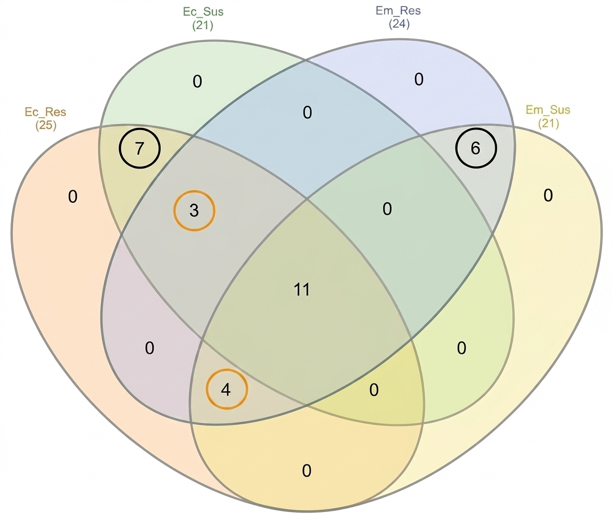
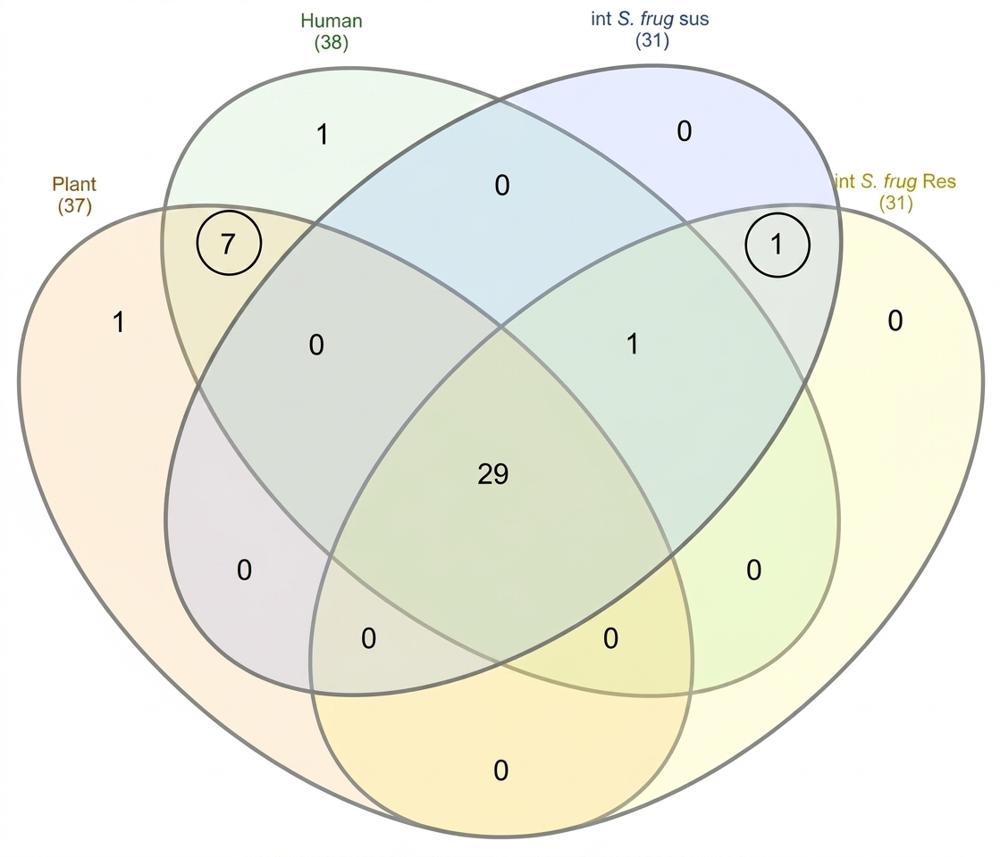

# *Spodoptera* Gut Microbiome Genomics
Comparative Genomics Analysis of Insect Gut Microbiota Associated with Pesticide Resistance

# Comparative Genomics of Enterococcus Strains Associated with Pesticide Degradation


---

## Project Overview

This project was developed as part of the **Microbial Genomics for One Health** course organized by INTA and UNU-BIOLAC.

The objective was to perform a comparative genomics analysis of bacterial strains associated with the gut microbiota of *Spodoptera frugiperda*, with special emphasis on genes potentially involved in pesticide degradation and their relevance within the One Health framework.

---

## One Health Perspective

<p align="center">
  
</p>

The One Health approach recognizes the strong connections between human health, animal health, and environmental health. Understanding microbial functions involved in pesticide degradation may contribute to sustainable agricultural practices and environmental protection.

---

## Objectives

* Explore bacterial genomes associated with insect gut microbiota.
* Compare genomic characteristics among strains.
* Identify genes potentially related to pesticide degradation.
* Investigate functional similarities and differences between genomes.
* Interpret findings within a One Health framework.

---

## Workflow

```text
Genome Selection
        ↓
Genome Retrieval
        ↓
Comparative Genomics Analysis
        ↓
Gene Annotation
        ↓
Functional Characterization
        ↓
Identification of Pesticide-Related Genes
        ↓
Biological Interpretation
```

---

## Repository Structure

```text
spodoptera-gut-microbiome-genomics
│
├── README.md
│
├── report/
│   └── Comparative_Genomics_Report.pdf
│
├── figures/
│   ├── one_health.png
│   ├── workflow.png
│   ├── phylogenetic_tree.jpg
│   ├── genome_comparison.png
│   └── pesticide_genes.png
│
├── data/
│   ├── genome_accessions.csv
│   ├── strain_metadata.csv
│   └── supplementary_tables.xlsx
│
├── docs/
│   ├── methodology.md
│   └── references.md
│
└── LICENSE
```

---

## Methods

The project involved the following bioinformatics analyses:

* Comparative genomics
* Genome annotation
* Functional gene analysis
* Comparative evaluation of bacterial strains
* Identification of genes potentially involved in pesticide degradation
* Biological interpretation of genomic features

---

## Main Findings

Key findings obtained during the analysis include:

* Identification of genomic similarities and differences among bacterial strains.
* Detection of genes associated with metabolic pathways potentially related to pesticide degradation.
* Functional evidence supporting the ecological role of gut-associated bacteria.
* Insights into microbial contributions to environmental adaptation and resilience.

---

## Key Results

- 9 Enterococcus genomes analyzed.
- Genome completeness greater than 99% in all strains.
- Identification of species-specific orthogroups.
- Detection of genes associated with xenobiotic metabolism.
- Comparative genomic evidence supporting adaptation to pesticide exposure.
- Confirmation of taxonomic relationships through ANI, dDDH and phylogenomic analyses.

---

## Results

### Phylogenetic Tree

<p align="center">
  
</p>

### Phylogenetic Analysis

The phylogenomic trees generated using 100 and 500 single-copy genes showed a consistent clustering pattern.

| Main observation | Interpretation |
|------------------|---------------|
| *E. mundtii* isolates clustered together | Supports species assignment |
| *E. casseliflavus* isolates clustered together | Supports species assignment |
| Resistant and susceptible strains remained closely related | Resistance was not associated with major phylogenetic divergence |

### Genome Comparison

<table align="center" style="border: none; border-collapse: collapse;">
  <tr style="border: none;">
    <td align="center" style="border: none; padding: 10px;">
      <br>
      <sub><b>Grouping of species according to their phenotype</b></sub>
    </td>
    <td align="center" style="border: none; padding: 10px;">
      <br>
      <sub><b>Grouping of species according to their origin</b></sub>
    </td>
  </tr>
</table>

### Orthogroup Analysis

| Group | Exclusive Orthogroups |
|---------|---------|
| *Enterococcus casseliflavus* | 7 |
| *Enterococcus mundtii* | 6 |
| Resistant *E. casseliflavus* | 4 |
| Resistant *E. mundtii* | 1 |

These results suggest species-specific genomic signatures, although no orthogroup clearly explained pesticide resistance.

### Genome Assembly Statistics

| Strain | Genome Size (Mb) | Contigs | GC (%) |
|---------|---------|---------|---------|
| *IIL-SusEm* | 2.87 | 230 | 38.45 |
| IIL-Luf18 | 2.92 | 126 | 38.31 |
| IIL-Sp24 | 3.01 | 148 | 38.38 |
| IIL-CI25 | 2.99 | 187 | 38.49 |
| IIL-SusEc | 3.87 | 147 | 42.32 |
| IIL-Sp06 | 4.10 | 181 | 42.15 |
| IIL-LC32 | 3.93 | 272 | 42.29 |
| IIL-Cl05 | 4.03 | 131 | 42.08 |
| IIL-Dm01 | 4.02 | 215 | 42.22 |

## Functional Analysis

The orthologous genes identified were associated with:

| Functional Category | Biological Relevance |
|---------------------|---------------------|
| Pyrimidine metabolism | Cellular growth and DNA synthesis |
| Drug metabolism pathways | Potential xenobiotic transformation |
| Orotate phosphoribosyltransferase activity | Nucleotide biosynthesis |
| Xenobiotic-related pathways | Possible contribution to pesticide degradation |

---

## Skills Demonstrated

* Comparative Genomics
* Microbial Genomics
* Genome Annotation
* Functional Genomics
* Biological Data Analysis
* Scientific Literature Interpretation
* Microbiome Research
* One Health
* Bioinformatics

---

## Tools and Resources

The analyses were performed using publicly available genomic databases and bioinformatics resources, including:

* NCBI
* Genome annotation resources
* Comparative genomics tools
* Scientific literature databases

---

## Relevance

Understanding microbial genes involved in pesticide degradation may contribute to future research on:

* Sustainable agriculture
* Environmental remediation
* Insect-microbiome interactions
* One Health initiatives

---

## Author

Caren Moreno

MSc in Bioinformatics

Universidad Internacional de La Rioja (UNIR)

---

## License

This project is distributed under the GPL-3.0  License.
