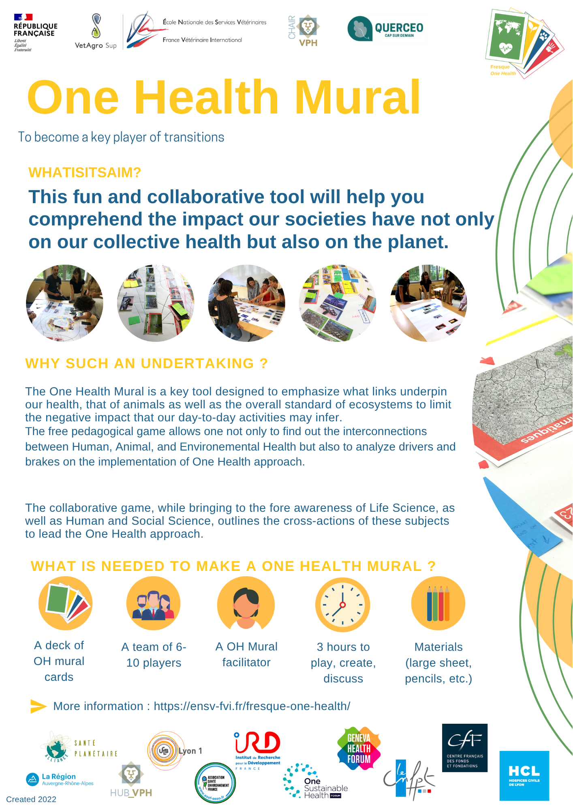
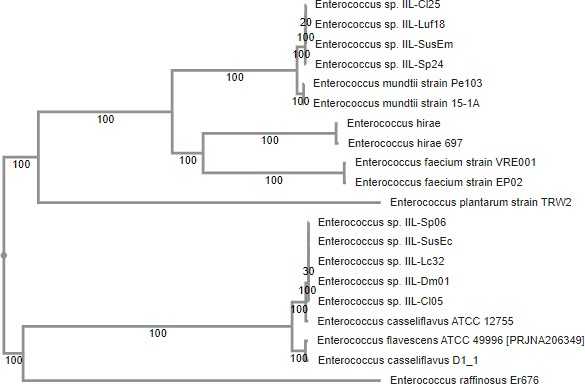

# Spodoptera Gut Microbiome Genomics
Comparative Genomics Analysis of Insect Gut Microbiota Associated with Pesticide Resistance

# Comparative Genomics of Enterococcus Strains Associated with Pesticide Degradation


---

## Project Overview

This project was developed as part of the **Microbial Genomics for One Health** course organized by INTA and UNU-BIOLAC.

The objective was to perform a comparative genomics analysis of bacterial strains associated with the gut microbiota of *Spodoptera frugiperda*, with special emphasis on genes potentially involved in pesticide degradation and their relevance within the One Health framework.

---

## One Health Perspective

<p align="center">
  
</p>

The One Health approach recognizes the strong connections between human health, animal health, and environmental health. Understanding microbial functions involved in pesticide degradation may contribute to sustainable agricultural practices and environmental protection.

---

## Objectives

* Explore bacterial genomes associated with insect gut microbiota.
* Compare genomic characteristics among strains.
* Identify genes potentially related to pesticide degradation.
* Investigate functional similarities and differences between genomes.
* Interpret findings within a One Health framework.

---

## Workflow

```text
Genome Selection
        ↓
Genome Retrieval
        ↓
Comparative Genomics Analysis
        ↓
Gene Annotation
        ↓
Functional Characterization
        ↓
Identification of Pesticide-Related Genes
        ↓
Biological Interpretation
```

---

## Repository Structure

```text
spodoptera-gut-microbiome-genomics
├── README.md
│
├── report/
│   └── Comparative_Genomics_Report.pdf
│
├── figures/
│   ├── one_health.png
│   ├── workflow.png
│   ├── phylogenetic_tree.png
│   ├── genome_comparison.png
│   └── pesticide_genes.png
│
├── data/
│   ├── genome_accessions.csv
│   ├── strain_metadata.csv
│   └── supplementary_tables.xlsx
│
├── docs/
│   ├── methodology.md
│   └── references.md
│
└── LICENSE
```

---

## Methods

The project involved the following bioinformatics analyses:

* Comparative genomics
* Genome annotation
* Functional gene analysis
* Comparative evaluation of bacterial strains
* Identification of genes potentially involved in pesticide degradation
* Biological interpretation of genomic features

---

## Main Findings

Key findings obtained during the analysis include:

* Identification of genomic similarities and differences among bacterial strains.
* Detection of genes associated with metabolic pathways potentially related to pesticide degradation.
* Functional evidence supporting the ecological role of gut-associated bacteria.
* Insights into microbial contributions to environmental adaptation and resilience.

---

## Results

### Phylogenetic Tree

<p align="center">
  
</p>

### Comparative Genomics Workflow

<p align="center">
  
</p>

### Genome Comparison

<p align="center">
  
</p>

### Functional Analysis

<p align="center">
  
</p>

---

## Skills Demonstrated

* Comparative Genomics
* Microbial Genomics
* Genome Annotation
* Functional Genomics
* Biological Data Analysis
* Scientific Literature Interpretation
* Microbiome Research
* One Health
* Bioinformatics

---

## Tools and Resources

The analyses were performed using publicly available genomic databases and bioinformatics resources, including:

* NCBI
* Genome annotation resources
* Comparative genomics tools
* Scientific literature databases

---

## Relevance

Understanding microbial genes involved in pesticide degradation may contribute to future research on:

* Sustainable agriculture
* Environmental remediation
* Insect-microbiome interactions
* One Health initiatives

---

## Author

Caren Moreno

Master's Degree in Bioinformatics

Universidad Internacional de La Rioja (UNIR)

---

## License

This project is distributed under the GNU License.
